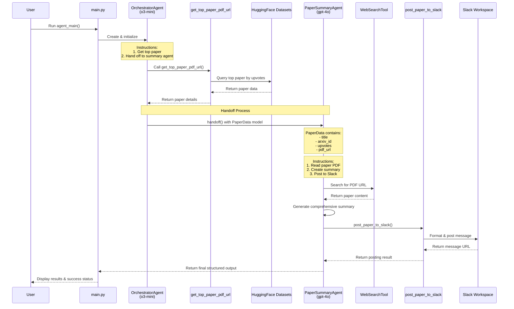

# Agent Workflow

This diagram illustrates the detailed workflow between agents, including the handoff process, data flow, and the sequence of operations.

The sequence diagram shows:
1. The user initiates the process
2. The main script creates the orchestrator agent
3. The orchestrator gets paper information and hands off to the summary agent
4. The summary agent retrieves and processes the paper
5. The summary agent posts to Slack
6. Results are returned to the user 