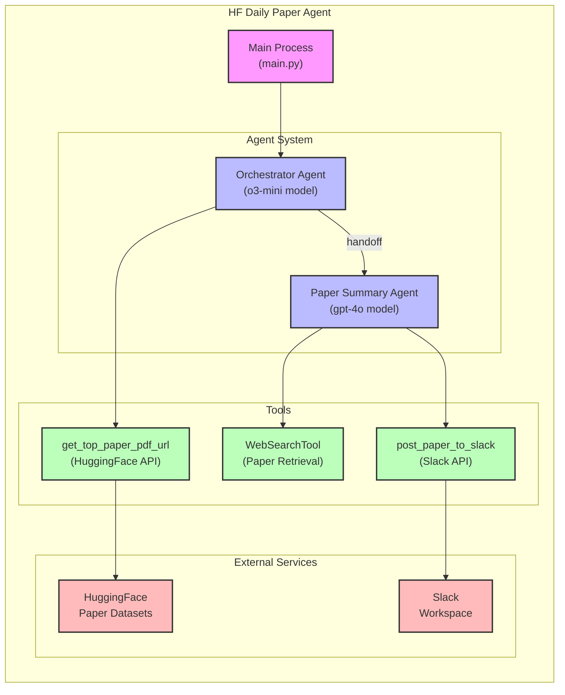

# Architecture Overview

This diagram illustrates the overall architecture of the HF Daily Paper Agent system, showing the main components and their relationships.

The diagram shows:
- The main process that starts the agent system
- Two AI agents with their respective models
- The handoff relationship between the agents
- Three tools used by the agents
- External services that the tools interact with 