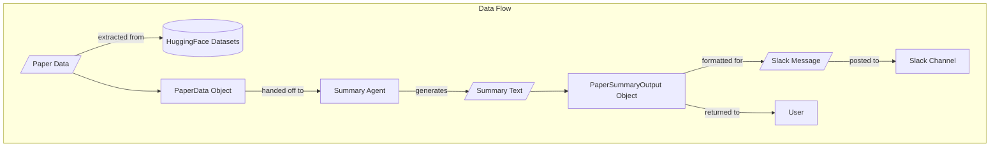
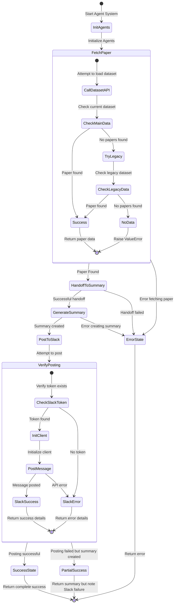

# Data Flow and Error Handling

This diagram illustrates the data flow throughout the system and how errors are handled at different stages.

The diagrams show:
1. The flow of data from HuggingFace datasets through the system to Slack and back to the user
2. The state transitions showing error handling at each stage of the process
3. How the system attempts to recover from certain errors (e.g., falling back to legacy datasets) 