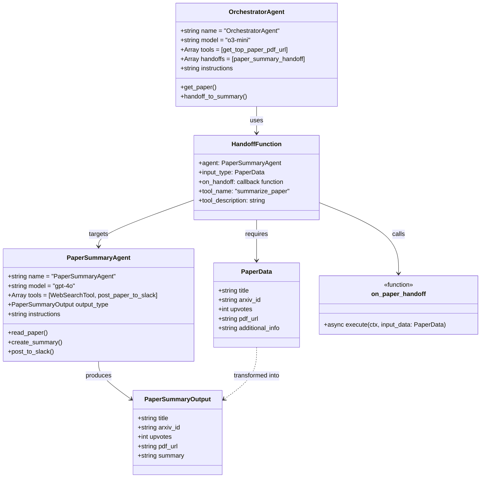

# Agent Handoff Process

This diagram illustrates the detailed handoff process between the orchestrator and summary agents, including the data models and callback functions.

```mermaid
flowchart TD
    subgraph "Handoff Process"
        A[OrchestratorAgent] -->|1. Gets paper info| B[Paper Data]
        B -->|2. Constructs| C[PaperData Object]
        C -->|3. Passes to| D[handoff]
        D -->|4. Calls| E[on_paper_handoff]
        E -->|5. Activates| F[PaperSummaryAgent]
        F -->|6. Receives| C
        F -->|7. Processes Paper| G[Generate Summary]
        G -->|8. Creates| H[PaperSummaryOutput]
        H -->|9. Posts to Slack| I[Slack Channel]
    end
    
    style A fill:#bbf,stroke:#333,stroke-width:2px
    style B fill:#f9f,stroke:#333,stroke-width:2px
    style C fill:#fbb,stroke:#333,stroke-width:2px
    style D fill:#bfb,stroke:#333,stroke-width:2px
    style E fill:#bfb,stroke:#333,stroke-width:2px
    style F fill:#bbf,stroke:#333,stroke-width:2px
    style G fill:#bfb,stroke:#333,stroke-width:2px
    style H fill:#fbb,stroke:#333,stroke-width:2px
    style I fill:#fbb,stroke:#333,stroke-width:2px
```

The diagrams show:
1. The class model showing the relationship between agents, data models, and the handoff mechanism
2. The step-by-step flow of the handoff process from orchestrator to summary agent 