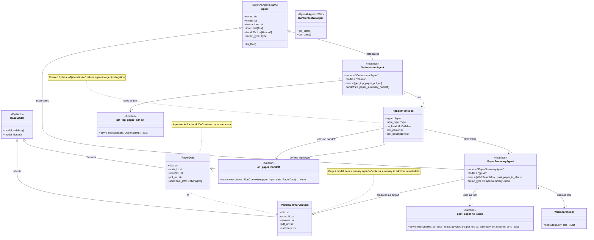

# Improved Class Diagram

This improved class diagram uses standard UML notation to accurately represent the relationship between the classes and data models in the HF Daily Paper Agent system.

## Class Relationship Analysis

The diagram above clarifies the following key relationships:

1. **Inheritance**:
   - Both `PaperData` and `PaperSummaryOutput` inherit from Pydantic's `BaseModel`
   - They are **separate classes** that share a common parent, not derived from each other

2. **Instance Relationships**:
   - `OrchestratorAgent` and `PaperSummaryAgent` are instances of the SDK's `Agent` class
   - They are configured with different settings, tools, and purposes

3. **Data Flow**:
   - The dotted arrow with stereotype `<<transforms data to>>` shows that data flows from `PaperData` to `PaperSummaryOutput`
   - This is a logical transformation performed by the agent, not an inheritance relationship
   - The agent extracts fields from `PaperData` and adds a `summary` field to create `PaperSummaryOutput`

4. **Handoff Mechanism**:
   - `HandoffFunction` connects the two agents, defining how data flows between them
   - It specifies `PaperData` as the input type and references the callback function

This diagram uses standard UML notation while still illustrating the conceptual "transformation" of data that occurs during the handoff process. 