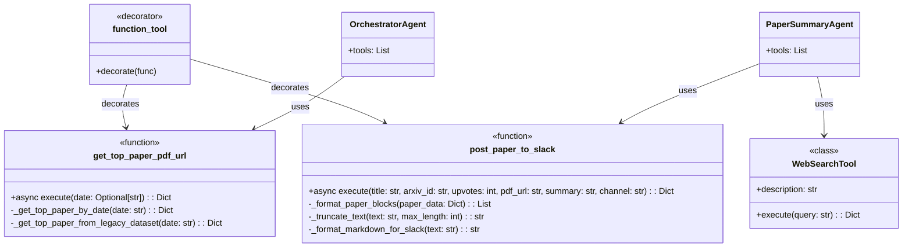

# Tool Implementation

This diagram illustrates the implementation details of the tools used in the system, their interfaces, and how they integrate with the agents.

```mermaid
flowchart TB
    subgraph "Tool Execution Flow"
        A[Agent calls tool] --> B{Tool Type?}
        B -->|function_tool| C[Call asynchronous function]
        B -->|WebSearchTool| D[Execute web search]
        
        C --> E[Process function result]
        D --> F[Process web search result]
        
        E --> G[Return to agent]
        F --> G
    end
    
    subgraph "get_top_paper_pdf_url Tool"
        T1[Function decorated with @function_tool] --> T2[Call HuggingFace datasets]
        T2 --> T3[Process dataset results]
        T3 --> T4{Found paper?}
        T4 -->|Yes| T5[Format and return paper data]
        T4 -->|No| T6[Try legacy dataset]
        T6 --> T3
    end
    
    subgraph "post_paper_to_slack Tool"
        S1[Function decorated with @function_tool] --> S2[Format message for Slack]
        S2 --> S3[Initialize Slack WebClient]
        S3 --> S4[Post message to channel]
        S4 --> S5[Return message URL and status]
    end
```

The diagrams show:
1. The class diagram illustrates the structure of the tools and their relationships with agents
2. The flowchart demonstrates the execution flow when agents call tools
3. Detailed flow for each specific tool implementation 